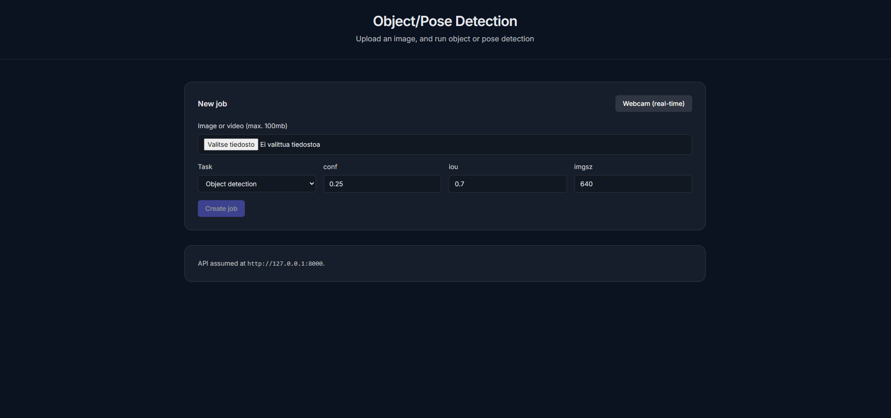
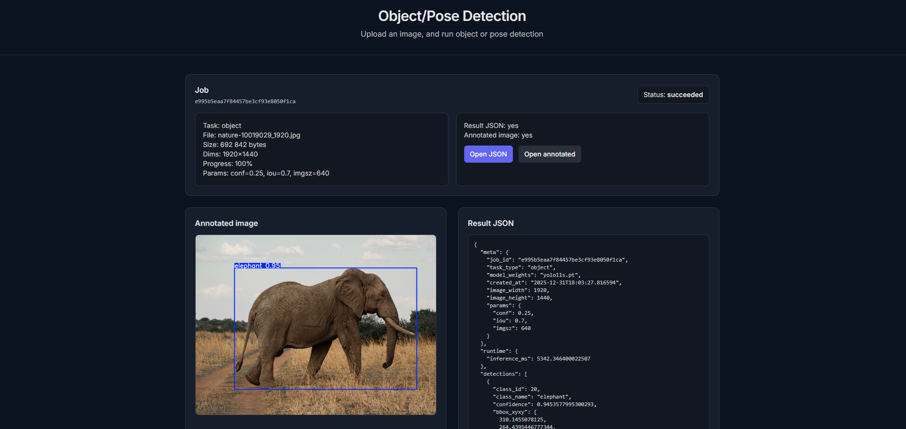

# Object & Pose Detection (YOLO11)

## Screenshots




## Backend

### Requirements

- Python 3.11+
- NVIDIA GPU + CUDA

### Setup

Create environment:
```
python -m venv .venv
```

Activate environment:

```
.\.venv\Scripts\Activate.ps1
```

Install dependencies:

```
pip install -r requirements.txt
```

## Run API

```
uvicorn app.main:app --reload --host 127.0.0.1 --port 8000
```

On startup, the API creates these (if missing):

- `backend/data/`
- `backend/data/inputs/`
- `backend/data/outputs/`
- `backend/data/app.db`

### Run Worker

```
python worker/main.py
```

### Model weights

Defaults (downloaded automatically):

- Object: `yolo11s.pt`
- Pose: `yolo11s-pose.pt`

### API

Base URL: `http://127.0.0.1:8000`

- `POST /api/jobs`
- `GET /api/jobs/{id}`
- `GET /api/jobs/{id}/result`
- `GET /api/jobs/{id}/annotated`

## Frontend

### Setup

Install dependencies:

```
npm install
```

Start dev server:

```
npm run dev
```

## Author

Ville Pakarinen (@vpakarinen2)
